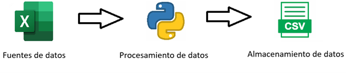

# Censo Viterbo Caldas 2018

    <!-- python -->
    
    <!-- pandas -->
    
    <!-- jupyter notebook -->
    
    

## Tabla de Contenidos
- [Introducción](#introducción)
- [Objetivo](#objetivo)
- [Alcance](#alcance)
- [Fuentes de Datos](#fuentes-de-datos)
    - [Licencia](#licencia)
    - [Alcance](#alcance-1)
    - [Ubicación de los Archivos Fuente en el Proyecto](#ubicación-de-los-datos-en-el-proyecto)
        - [Lista de Archivos Fuente](#lista-de-archivos-fuente)
        - [Datos Procesados](#datos-procesados)
    - [Estructura de Los Datos Fuente](#estructura-de-los-datos-fuente)
        - [Lista de Hojas](#lista-de-hojas)
        - [Estructura de Hojas](#estructura-de-hojas)
            - [1PM](#1pm)
            - [3PM](#3pm)
            - [4PM](#4pm)
            - [5.1PM](#51pm)
            - [5.2PM](#52pm)
            - [12PM](#12pm)
            - [13PM](#13pm)
            - [14PM](#14pm)
            - [15PM](#15pm)
            - [16PM](#16pm)
            - [17PM](#17pm)
            - [18PM](#18pm)
            - [19PM](#19pm)
- [Procesamiento de Datos](#procesamiento-de-datos)
    - [Herramientas](#herramientas)

## 📖 Introducción
Durante el año 2018 se llevó al cabo el Censo Nacional de Población y Vivienda en Colombia, el cual “consistió en contar y caracterizar las personas residentes en Colombia, así como las viviendas y los hogares del territorio nacional” [DANE, 2018](https://www.dane.gov.co/index.php/estadisticas-por-tema/demografia-y-poblacion/censo-nacional-de-poblacion-y-vivenda-2018). Dicho censo no solo contó el número de personas en el país, también recolectó datos de dónde y cómo viven sus ciudadanos.

## 🚀 Objetivo
Poner a disposición del público general una versión de fácil acceso a los datos del Censo Nacional de Población y Vivienda en Colombia del año 2018 del municipio de Viterbo Caldas.

## 🔎 Alcance
Este proyecto solo considerará los datos del municipio de Viterbo, Caldas, los datos del resto del país están fuera del alcance.
 
 
Este proyecto solo se tratará de la extracción de los datos, el proyecto no contempla ningún análisis sobre los datos.

## ⬇️ Fuentes de Datos
Los datos para este proyecto fueron sustraídos de la [página oficial del Departamento Nacional de Estadística](https://www.dane.gov.co/index.php/estadisticas-por-tema/demografia-y-poblacion/censo-nacional-de-poblacion-y-vivenda-2018), del ítem "Cuadros personas demográfico – CNPV 2018".

### ✅ Licencia
El aprovechamiento de estos datos se rige por la Ley de Datos Abiertos colombiana, Ley 1712 de 2014.

### ⚠️ Alcance
Los datos proporcionados son datos públicos recolectados por el DANE, no es posible la individualización de ningún ciudadano que haya proporcionado datos para el censo.
 
 
Los datos corresponden solamente a Colombia.
 
 
Los datos corresponden solamente a las personas que fueron efectivamente encuestadas durante el censo.

### 📂 Ubicación de los Datos en el Proyecto
El archivo fuente estará en la ruta _Censo Viterbo Caldas 2018/Data/Original/_

#### Lista de archivos fuente:

| **Nombre Archivo**                     | **Extensión** | **Tamaño [MB]** |
|----------------------------------------|---------------|-----------------|
| PERSONAS_DEMOGRAFICO_Cuadros_CNPV_2018 | xlsx          | 137             |

#### Datos Procesados
Los datos preparados se almacenarán en la ruta _Censo Viterbo Caldas 2018/Data/Datasets/_  y tendrán la convención de nombre _departamento_municipio_hoja.csv_ y _departamento_municipio_total_hoja.csv_, ejemplo, _caldas_viterbo_1PM.csv_ o _caldas_viterbo_total_1PM.csv_.

### 🧱 Estructura de los Datos Fuente
El archivo fuente es un .xlsx que contiene 37 hojas, donde cada hoja contiene datos relacionados con un ítem, y pueden ser datos departamentales, municipales o totales nacionales.
 

La primera hoja es el índice del archivo fuente, allí se detallan las hojas, abreviaturas y descripciones. Excepto por el índice, el nombre de cada hoja está compuesto por un número, la letra **P** y la letra **D**, **M** o **T**, donde
- **PD**: Personas Departamental
- **PM**: Personas Municipal
- **PT**: Personas Total Nacional
- **PP**: Principales países

Por el alcance de este proyecto, se utilizarán solo las hojas relacionadas con datos municipales.

#### Lista de Hojas

| **Nombre** | **Descripción**                                                                                                                                                                                                                                             | **Rango**                 | **Filas** |
|------------|-------------------------------------------------------------------------------------------------------------------------------------------------------------------------------------------------------------------------------------------------------------|---------------------------|-----------|
| 1PM        | Población total censada, por sexo e índices de masculinidad y feminidad, según municipio, áreas (Total, Cabecera y Centros poblados y Rural disperso) y grupos de edad                                                                                      | C:I - 224196:24252        | 57        |
| 3PM        | Población censada, por sexo y áreas (Total, Cabecera y Centros poblados y Rural disperso), según municipios y edades simples                                                                                                                                |     C:P - 42485:42607      | 123       |
| 4PM        |     Población censada en hogares   particulares, por relación o parentesco con el jefe(a) del hogar, según   sexo, municipio y áreas (Total, Cabecera y Centros poblados y Rural   disperso)                                                                |     C:U - 3846:3854       | 9         |
| 5.1PM      | Población censada en hogares particulares, por relación o parentesco con el jefe(a) de hogar, según municipio, área (Total, Cabecera y Centros poblados y Rural disperso) y grupo de edad                                                                   |     C:U - 24196:24252     | 57        |
| 5.2PM      | Población censada en hogares particulares, por relación o parentesco con el jefe(a) de hogar, según municipio, área (Total, Cabecera y Centros poblados y Rural disperso), sexo y grupo de edad                                                             |     C:V - 48170:48283     | 114       |
| 12PM       | Población censada en hogares particulares, por auto reconocimiento étnico y área (Total, Cabecera y Centros poblados y Rural disperso), según municipio y grupos de edad                                                                                    |     C:AL - 6568:6586      | 19        |
| 13PM       | Población censada en hogares particulares, por auto reconocimiento étnico y áreas (Total, Cabecera y Centros poblados y Rural disperso), según Municipio y territorialidad étnica                                                                           |     C:AL - 749:751        | 3         |
| 14PM       | Población censada en hogares que en los últimos treinta días tuvieron alguna enfermedad, accidente, problema odontológico u otro problema de salud, por áreas (Total, Cabecera y Centros poblados y Rural disperso), servicio de salud al que hayan acudido |     C:BS - 19678:19734    | 57        |
| 15PM       | Población menor de 5 años, censada en hogares particulares, por dónde o con quién permanece durante la mayor parte del tiempo entre semana el menor, según municipios, áreas (Total, Cabecera y Centros poblados y Rural disperso), sexo y edades simple    |     C:N - 22610:22663     | 54        |
| 16PM       | Población censada en hogares particulares, por sexo y alfabetismo, según municipio, áreas (Total, Cabecera y Centros poblados y Rural disperso) y grandes grupos de edad                                                                                    |     C:S - 3847:3855       | 9         |
| 17PM       | Población censa da en hogares, de 5 años y más de edad, por asistencia escolar y sexo, según municipio y áreas y (Total, Cabecera y Centros poblados y Rural disperso) y grupos de edad escolar                                                             |     C:T - 3846:3854       | 9         |
| 18PM       | Población censada en hogares particulares, de 5 años y más de edad, por asistencia escolar y sexo, según municipio y áreas y (Total, Cabecera y Centros poblados y Rural disperso) y grupos de edad escolar                                                 |     C:S - 8959:8979       | 21        |
| 19PM       | Población censada en hogares particulares, de 5 años y más de edad, por asistencia escolar y sexo, según municipio, áreas (Total, Cabecera y Centros poblados y Rural disperso) y grupos de edad escolar                                                    |     C:U - 18211:18263     | 53        |

 

#### Estructura de Hojas
##### 1PM
Contiene 6 columnas y 4 agrupaciones.

Columnas:
| **Nombre de columna**  | **Tipo de dato** | **Descripción**        |
|------------------------|------------------|------------------------|
| Grupos de edad         | texto            | Rango de edad          |
| Total                  | entero           | Cantidad total         |
| Sexo Hombre            | entero           | Cantidad de hombres    |
| Sexo Mujer             | entero           | Cantidad de mujeres    |
| Índice de masculinidad | decimal          | Índice de masculinidad |
| Índice de feminidad    | decimal          | Índice de feminidad    |

 

Agrupaciones:
| **Nombre de grupo** | **Descripción**                                                                                                        |
|---------------------|------------------------------------------------------------------------------------------------------------------------|
| Total               | Grupo con resumen de datos totales                                                                                     |
| Cabecera            | Grupo con resumen de datos correspondientes a las cabeceras municipales                                                |
| Centro Poblado      | Grupo con resumen de datos correspondientes a centros poblados                                                         |
| Rural Disperso      | Grupo con resumen de datos correspondientes a ciudadanos que habitan en las zonas rurales, pero no en centros poblados |

##### 3PM
Contiene 12 columnas fuertemente agrupadas por Sexo, Cabecera (Grupo con datos correspondientes a las cabeceras municipales), Centro Poblado (Grupo con datos correspondientes a centros poblados), Rural Disperso (Grupo con datos correspondientes a ciudadanos que habitan en las zonas rurales, pero no en centros poblados).

Contiene filas correspondientes a grupos de edad.

Columnas:
| **Nombre de columna** | **Tipo de dato** | **Descripción**                                                    |
|-----------------------|------------------|--------------------------------------------------------------------|
| (blank)               | texto            | Título en blanco, contiene las edades                              |
| Sexo Total            | entero           | Cantidad total                                                     |
| Sexo Hombre           | entero           | Cantidad de hombres                                                |
| Sexo Mujer            | entero           | Cantidad de mujeres                                                |
| Cabecera Total        | entero           | Cantidad total en cabeceras municipales                            |
| Cabecera Hombre       | entero           | Cantidad de hombres en cabeceras municipales                       |
| Cabecera Mujer        | entero           | Cantidad de mujeres en cabeceras municipales                       |
| Centro Poblado Total  | entero           | Cantidad total en centros poblados                                 |
| Centro Poblado Hombre | entero           | Cantidad de hombres en centros poblados                            |
| Centro Poblado Mujer  | entero           | Cantidad de mujeres en centros poblados                            |
| Rural disperso Total  | entero           | Cantidad total en zona rural que no hace parte de centros poblados |
| Rural disperso Hombre | entero           | Cantidad de hombres en zona rural                                  |
| Rural disperso Mujer  | entero           | Cantidad de mujeres en zona rural                                  |

##### 4PM
Contiene 17 columnas y 3 agrupaciones, cada agrupación tiene 3 subgrupos.

Columnas:
| **Nombre de columna**                      | **Tipo de dato** | **Descripción**                                                         |
|--------------------------------------------|------------------|-------------------------------------------------------------------------|
| Total                                      | entero           | Cantidad total                                                          |
| Jefe(a) del hogar                          | entero           | Cantidad de censados que son jefes del hogar                            |
| Pareja (Conyugue, Compañero(a), esposo(a)) | entero           | Cantidad de censados que son pareja del jede del hogar                  |
| Hijo(a)                                    | entero           | Cantidad de censados que son hijos del jefe del hogar                   |
| Hijastro(a)                                | entero           | Cantidad de censados que son hijastros del jefe del hogar               |
| Yerno/nuera                                | entero           | Cantidad de censados que son yernos o nueras del jefe del hogar         |
| Padre/madre                                | entero           | Cantidad de censados que son padres o madres del jefe del hogar         |
| Padrastro, madrastra                       | entero           | Cantidad de censados que son padrastros o madrastras del jefe del hogar |
| Suegro(a)                                  | entero           | Cantidad de censados que son suegros del jefe del hogar                 |
| Hermano(a)                                 | entero           | Cantidad de censados que son hermanos del jefe del hogar                |
| Hermanastro(a)                             | entero           | Cantidad de censados que son hermanastros del jefe del hogar            |
| Cuñado(a)                                  | entero           | Cantidad de censados que son cuñados del jefe del hogar                 |
| Nieto(a)                                   | entero           | Cantidad de censados que son nietos del jefe del hogar                  |
| Abuelo(a)                                  | entero           | Cantidad de censados que son abuelos del jefe del hogar                 |
| Otro pariente                              | entero           | Cantidad de censados que son otro tipo de pariente del jefe del hogar   |
| Empleado(a) del servicio doméstico         | entero           | Cantidad de censados que son empleados domésticos del jefe del hogar    |
| No pariente                                | entero           | Cantidad de censados que no son parientes del jefe del hogar            |

 

Agrupaciones:
| **Nombre de columna** | **Descripción**                                                         |
|-----------------------|-------------------------------------------------------------------------|
| Total                 | Grupo con resumen de cantidades totales                                 |
| Cabecera              | Grupo con resumen de datos correspondientes a las cabeceras municipales |
| Rural disperso        | Grupo con resumen de datos correspondiente a la zona rural              |

 

Subgrupos:
| **Nombre de columna** | **Descripción**                                  |
|-----------------------|--------------------------------------------------|
| Total                 | Subgrupo con resumen total del grupo             |
| Hombre                | Subgrupo de datos correspondientes a los hombres |
| Mujer                 | Subgrupo de datos correspondientes a las mujeres |

##### 5.1PM
Contiene 17 columnas y 3 agrupaciones, cada agrupación tiene 18 subgrupos que corresponden a rangos de edad

Columnas:
| **Nombre de columna**                      | **Tipo de dato** | **Descripción**                                                         |
|--------------------------------------------|------------------|-------------------------------------------------------------------------|
| Total                                      | entero           | Cantidad total                                                          |
| Jefe(a) del hogar                          | entero           | Cantidad de censados que son jefes del hogar                            |
| Pareja (Conyugue, Compañero(a), esposo(a)) | entero           | Cantidad de censados que son pareja del jede del hogar                  |
| Hijo(a)                                    | entero           | Cantidad de censados que son hijos del jefe del hogar                   |
| Hijastro(a)                                | entero           | Cantidad de censados que son hijastros del jefe del hogar               |
| Yerno/nuera                                | entero           | Cantidad de censados que son yernos o nueras del jefe del hogar         |
| Padre/madre                                | entero           | Cantidad de censados que son padres o madres del jefe del hogar         |
| Padrastro, madrastra                       | entero           | Cantidad de censados que son padrastros o madrastras del jefe del hogar |
| Suegro(a)                                  | entero           | Cantidad de censados que son suegros del jefe del hogar                 |
| Hermano(a)                                 | entero           | Cantidad de censados que son hermanos del jefe del hogar                |
| Hermanastro(a)                             | entero           | Cantidad de censados que son hermanastros del jefe del hogar            |
| Cuñado(a)                                  | entero           | Cantidad de censados que son cuñados del jefe del hogar                 |
| Nieto(a)                                   | entero           | Cantidad de censados que son nietos del jefe del hogar                  |
| Abuelo(a)                                  | entero           | Cantidad de censados que son abuelos del jefe del hogar                 |
| Otro pariente                              | entero           | Cantidad de censados que son otro tipo de pariente del jefe del hogar   |
| Empleado(a) del servicio doméstico         | entero           | Cantidad de censados que son empleados domésticos del jefe del hogar    |
| No pariente                                | entero           | Cantidad de censados que no son parientes del jefe del hogar            |

 

Agrupaciones:
| **Nombre de columna** | **Descripción**                                                         |
|-----------------------|-------------------------------------------------------------------------|
| Total                 | Grupo con resumen de cantidades totales                                 |
| Cabecera              | Grupo con resumen de datos correspondientes a las cabeceras municipales |
| Rural disperso        | Grupo con resumen de datos correspondiente a la zona rural              |

##### 5.2PM
Contiene 17 columnas y 2 agrupaciones, cada agrupación tiene 3 subgrupos y cada subgrupo tiene 18 subgrupos que corresponden a rangos de edad.

Columnas:
| **Nombre de columna**                      | **Tipo de dato** | **Descripción**                                                         |
|--------------------------------------------|------------------|-------------------------------------------------------------------------|
| Total                                      | entero           | Cantidad total                                                          |
| Jefe(a) del hogar                          | entero           | Cantidad de censados que son jefes del hogar                            |
| Pareja (Conyugue, Compañero(a), esposo(a)) | entero           | Cantidad de censados que son pareja del jede del hogar                  |
| Hijo(a)                                    | entero           | Cantidad de censados que son hijos del jefe del hogar                   |
| Hijastro(a)                                | entero           | Cantidad de censados que son hijastros del jefe del hogar               |
| Yerno/nuera                                | entero           | Cantidad de censados que son yernos o nueras del jefe del hogar         |
| Padre/madre                                | entero           | Cantidad de censados que son padres o madres del jefe del hogar         |
| Padrastro, madrastra                       | entero           | Cantidad de censados que son padrastros o madrastras del jefe del hogar |
| Suegro(a)                                  | entero           | Cantidad de censados que son suegros del jefe del hogar                 |
| Hermano(a)                                 | entero           | Cantidad de censados que son hermanos del jefe del hogar                |
| Hermanastro(a)                             | entero           | Cantidad de censados que son hermanastros del jefe del hogar            |
| Cuñado(a)                                  | entero           | Cantidad de censados que son cuñados del jefe del hogar                 |
| Nieto(a)                                   | entero           | Cantidad de censados que son nietos del jefe del hogar                  |
| Abuelo(a)                                  | entero           | Cantidad de censados que son abuelos del jefe del hogar                 |
| Otro pariente                              | entero           | Cantidad de censados que son otro tipo de pariente del jefe del hogar   |
| Empleado(a) del servicio doméstico         | entero           | Cantidad de censados que son empleados domésticos del jefe del hogar    |
| No pariente                                | entero           | Cantidad de censados que no son parientes del jefe del hogar            |

 

Agrupaciones:
| **Nombre de columna** | **Descripción**                                          |
|-----------------------|----------------------------------------------------------|
| Hombre                | Grupo con resumen de datos correspondiente a los hombres |
| Mujer                 | Grupo con resumen de datos correspondiente a las mujeres |

 

Subgrupos:
| **Nombre de columna** | **Descripción**                                                            |
|-----------------------|----------------------------------------------------------------------------|
| Total                 | Subgrupo con resumen de cantidades totales                                 |
| Cabecera              | Subgrupo con resumen de datos correspondientes a las cabeceras municipales |
| Rural disperso        | Subgrupo con resumen de datos correspondiente a la zona rural              |

##### 12PM
Contiene 8 columnas fuertemente agrupadas por Total (Resumen total de datos), Cabecera (Grupo con datos correspondientes a las cabeceras municipales), Centro Poblado (Grupo con datos correspondientes a centros poblados), Rural Disperso (Grupo con datos correspondientes a ciudadanos que habitan en las zonas rurales, pero no en centros poblados).

Contiene filas correspondientes a grupos de edad.

Columnas:
| **Nombre de columna**                                               | **Tipo de dato** | **Descripción**                                                                                                  |
|---------------------------------------------------------------------|------------------|------------------------------------------------------------------------------------------------------------------|
| Total                                                               | entero           | Cantidad total de censados en el grupo                                                                           |
| Indígena                                                            | entero           | Cantidad de censados que se reconocen como indígenas                                                             |
| Gitano(a) o Rrom                                                    | entero           | Cantidad de censados que se reconocen como gitanos o romaníes                                                    |
| Raizal del Archipielago de San Andrés, Providencia y Santa Catalina | entero           | Cantidad de censados que se reconocen como raizales del Archipiélago de San Andrés, Providencia y Santa Catalina |
| Palenquero(a) de San Basilio                                        | entero           | Cantidad de censados que se reconocen como palenqueros de San Basilio                                            |
| Negro(a), Mulato(a), Afrodescendiente, Afrocolombiano(a)            | entero           | Cantidad de censados que se reconocen como negros, mulatos, afrodescendientes o afrocolombianos                  |
| Ningún grupo étnico                                                 | entero           | Cantidad de censados que no se reconocen en ningún grupo étnico                                                  |
| Sin información                                                     | entero           | Cantidad de censados de los cuales no se tiene información sobre autorreconocimiento étnico                      |

##### 13PM
Contiene 8 columnas fuertemente agrupadas por Total (Resumen total de datos), Cabecera (Grupo con datos correspondientes a las cabeceras municipales), Centro Poblado (Grupo con datos correspondientes a centros poblados), Rural Disperso (Grupo con datos correspondientes a ciudadanos que habitan en las zonas rurales, pero no en centros poblados), y contiene 3 agrupaciones.

Columnas:
| **Nombre de columna**                                               | **Tipo de dato** | **Descripción**                                                                                                  |
|---------------------------------------------------------------------|------------------|------------------------------------------------------------------------------------------------------------------|
| Total                                                               | entero           | Cantidad total de censados en el grupo                                                                           |
| Indígena                                                            | entero           | Cantidad de censados que se reconocen como indígenas                                                             |
| Gitano(a) o Rrom                                                    | entero           | Cantidad de censados que se reconocen como gitanos o romaníes                                                    |
| Raizal del Archipielago de San Andrés, Providencia y Santa Catalina | entero           | Cantidad de censados que se reconocen como raizales del Archipiélago de San Andrés, Providencia y Santa Catalina |
| Palenquero(a) de San Basilio                                        | entero           | Cantidad de censados que se reconocen como palenqueros de San Basilio                                            |
| Negro(a), Mulato(a), Afrodescendiente, Afrocolombiano(a)            | entero           | Cantidad de censados que se reconocen como negros, mulatos, afrodescendientes o afrocolombianos                  |
| Ningún grupo étnico                                                 | entero           | Cantidad de censados que no se reconocen en ningún grupo étnico                                                  |
| Sin información                                                     | entero           | Cantidad de censados de los cuales no se tiene información sobre autorreconocimiento étnico                      |

 

Agrupaciones:
| **Nombre de columna** | **Descripción**                                                                               |
|-----------------------|-----------------------------------------------------------------------------------------------|
| Total                 | Resumen del total                                                                             |
| Territorio no étnico  | Grupo con resumen de datos correspondiente a ciudadanos que habitan en territorios no étnicos |
| Resguardo indígena    | Grupo con resumen de datos correspondiente a ciudadanos que habitan en resguardos indígenas   |

##### 14PM
Contiene 15 columnas fuertemente agrupadas por Total (Resumen total de datos), Cabecera (Grupo con datos correspondientes a las cabeceras municipales), Centro Poblado (Grupo con datos correspondientes a centros poblados), Rural Disperso (Grupo con datos correspondientes a ciudadanos que habitan en las zonas rurales, pero no en centros poblados), y a su vez contienen subgrupos por Tuvo alguna enfermedad en los 30 días y Servicio de salud donde acudieron.

Contiene filas correspondientes a grupos de edad.

Columnas:
| **Nombre de columna**                                             | **Tipo de dato** | **Descripción**                                                                                                                                         |
|-------------------------------------------------------------------|------------------|---------------------------------------------------------------------------------------------------------------------------------------------------------|
| Total personas                                                    | entero           | Cantidad total de censados del grupo                                                                                                                    |
| Sí                                                                | entero           | Cantidad de censados que tuvieron alguna enfermedad los últimos 30 días                                                                                 |
| No                                                                | entero           | Cantidad de censados que no tuvieron alguna enfermedad los últimos 30 días                                                                              |
| Sin información                                                   | entero           | Cantidad de censados de los cuales no se tiene información acerca de si tuvieron alguna enfermedad los últimos 30 días                                  |
| Total personas que tuvieron alguna enfermedad                     | entero           | Cantidad total de censados que tuvieron alguna enfermedad los últimos 30 días                                                                           |
| Sin información                                                   | entero           | Cantidad de censados de los cuales no se tiene información acerca del servicio de salud al que acudieron                                                |
| A la entidad de seguridad social en salud a la cual está afiliado | entero           | Cantidad de censados que tuvieron alguna enfermedad los últimos 30 días y acudieron a la entidad de seguridad social en salud a la cual están afiliados |
| A un médico particular                                            | entero           | Cantidad de censados que tuvieron alguna enfermedad los últimos 30 días y acudieron a un médico particular                                              |
| A un boticario, farmaceuta, droguista                             | entero           | Cantidad de censados que tuvieron alguna enfermedad los últimos 30 días y acudieron a un boticario, farmaceuta o droguista                              |
| A terapias alternativas                                           | entero           | Cantidad de censados que tuvieron alguna enfermedad los últimos 30 días y acudieron a terapias alternativas                                             |
| Acudió a una autoridad indígena espiritual                        | entero           | Cantidad de censados que tuvieron alguna enfermedad los últimos 30 días y acudieron a una autoridad indígena espiritual                                 |
| Otro médico de un grupo étnico                                    | entero           | Cantidad de censados que tuvieron alguna enfermedad los últimos 30 días y acudieron a otro médico de un grupo étnico                                    |
| Usó remedios caseros                                              | entero           | Cantidad de censados que tuvieron alguna enfermedad los últimos 30 días y usaron remedios caseros                                                       |
| Se autorrecetó                                                    | entero           | Cantidad de censados que tuvieron alguna enfermedad los últimos 30 días y se auto recetaron                                                             |
| No hizo anda                                                      | entero           | Cantidad de censados que tuvieron alguna enfermedad los últimos 30 días y no hicieron nada al respecto                                                  |

##### 15PM
Contiene 9 columnas y 3 agrupaciones.

Columnas:
| **Nombre de columna**                                                                      | **Tipo de dato** | **Descripción**                                                                                                                                                               |
|--------------------------------------------------------------------------------------------|------------------|-------------------------------------------------------------------------------------------------------------------------------------------------------------------------------|
| Total personas menores de 5 años                                                           | entero           | Cantidad de personas censadas menores de 5 años                                                                                                                               |
| Asiste a un hogar comunitario, jardín, centro de desarrollo infantil o colegio             | entero           | Cantidad de menores de 5 años censados que asisten a un hogar comunitario, jardín, centro de desarrollo infantil, o colegio la mayor parte del tiempo entre semana            |
| Con su padre o madre en la vivienda                                                        | entero           | Cantidad de menores de 5 años censados que permanecen con su padre o madre en la vivienda la mayor parte del tiempo entre semana                                              |
| Con su padre o madre en el trabajo                                                         | entero           | Cantidad de menores de 5 años censados que permanecen con su padre o madre en el trabajo la mayor parte del tiempo entre semana                                               |
| En la vivienda donde vive el niño al cuidado de un pariente o una persona de 18 años o más | entero           | Cantidad de menores de 5 años censados que permanecen en la vivienda donde viven al cuidado de un pariente o una persona mayor de edad la mayor parte del tiempo entre semana |
| En la vivienda donde vive el niño al cuidado de un pariente o una persona menor de 18 años | entero           | Cantidad de menores de 5 años censados que permanecen en la vivienda donde viven al cuidado de un pariente o persona menor de 18 años la mayor parte del tiempo entre semana  |
| Al cuidado de un pariente o de otra persona en otro lugar                                  | entero           | Cantidad de menores de 5 años censados que permanecen al cuidado de un pariente u otra persona en un lugar diferente a los mencionados la mayor parte del tiempo entre semana |
| En la vivienda, solo                                                                       | entero           | Cantidad de menores de 5 años que permanecen en la vivienda solos la mayor parte del tiempo entre semana                                                                      |
| Sin información                                                                            |                  | Cantidad de menores de 5 años censados de los cuales no se tiene información sobre donde permanecen la mayor parte del tiempo entre semana                                    |

##### 16PM
Contiene 3 columnas fuertemente agrupadas por Total (resumen total de datos), Si (grupo con datos correspondientes a los censados que saben leer y escribir), No (grupo con datos correspondientes a los censados que no saben leer y escribir), Sin información (grupo con datos correspondientes a los censados de los cuales no se conoce si saben leer y escribir)

Contiene 4 agrupaciones.

Columnas:
| **Nombre de columna** | **Tipo de dato** | **Descripción**     |
|-----------------------|------------------|---------------------|
| Total                 | entero           | Cantidad total      |
| Hombre                | entero           | Cantidad de hombres |
| Mujer                 | entero           | Cantidad de mujeres |

 

Agrupaciones:
| **Nombre de columna** | **Descripción**                                                                                                        |
|-----------------------|------------------------------------------------------------------------------------------------------------------------|
| Total                 | Grupo con resumen de datos totales                                                                                     |
| Cabecera              | Grupo con resumen de datos correspondientes a las cabeceras municipales                                                |
| Centro Poblado        | Grupo con resumen de datos correspondientes a centros poblados                                                         |
| Rural disperso        | Grupo con resumen de datos correspondientes a ciudadanos que habitan en las zonas rurales, pero no en centros poblados |

##### 17PM
Contiene 16 columnas y 3 agrupaciones

Columnas:
| **Nombre de columna**                | **Tipo de dato** | **Descripción**                                                                          |
|--------------------------------------|------------------|------------------------------------------------------------------------------------------|
| Total                                | entero           | Cantidad total de censados                                                               |
| Ninguno                              | entero           | Cantidad de censados sin ningún nivel educativo                                          |
| Preescolar                           | entero           | Cantidad de censados cuyo máximo nivel educativo es preescolar                           |
| Primaria completa                    | entero           | Cantidad de censados cuyo máximo nivel educativo es primaria completa                    |
| Primaria incompleta                  | entero           | Cantidad de censados cuyo máximo nivel educativo es primaria incompleta                  |
| Secundaria completa                  | entero           | Cantidad de censados cuyo máximo nivel educativo es secundaria completa                  |
| Secundaria incompleta                | entero           | Cantidad de censados cuyo máximo nivel educativo es secundaria incompleta                |
| Media completa                       | entero           | Cantidad de censados cuyo máximo nivel educativo es educación media completa             |
| Media incompleta                     | entero           | Cantidad de censados cuyo máximo nivel educativo es educación media incompleta           |
| Normal completa                      | entero           | Cantidad de censados cuyo máximo nivel educativo es educación normal completa            |
| Normal incompleta                    | entero           | Cantidad de censados cuyo máximo nivel educativo es educación normal incompleta          |
| Tecnico                              | entero           | Cantidad de censados cuyo máximo nivel educativo es técnico                              |
| Tecnológico                          | entero           | Cantidad de censados cuyo máximo nivel educativo es tecnológico                          |
| Universitario                        | entero           | Cantidad de censados cuyo máximo nivel educativo es universitario                        |
| Especialización, Maestría, Doctorado | entero           | Cantidad de censados cuyo máximo nivel educativo es especialización maestría o doctorado |
| Sin información                      | entero           | Cantidad de censados de los cuales no se tiene información acerca de su nivel educativo  |

##### 18PM
Contiene 3 columnas fuertemente agrupadas por Total (resumen total de datos), Si (grupo con datos correspondientes a los censados que asisten a alguna institución educativa), No (grupo con datos correspondientes a los censados que asisten a alguna institución educativa), Sin información (grupo con datos correspondientes a los censados de los cuales no se conoce si asisten a alguna institución educativa)

Contiene 3 agrupaciones.

Columnas:
| **Nombre de columna** | **Tipo de dato** | **Descripción**     |
|-----------------------|------------------|---------------------|
| Total                 | entero           | Cantidad total      |
| Hombre                | entero           | Cantidad de hombres |
| Mujer                 | entero           | Cantidad de mujeres |

 

Agrupaciones:
| **Nombre de columna** | **Descripción**                                                                                                        |
|-----------------------|------------------------------------------------------------------------------------------------------------------------|
| Total                 | Grupo con resumen de datos totales                                                                                     |
| Cabecera              | Grupo con resumen de datos correspondientes a las cabeceras municipales                                                |
| Rural disperso        | Grupo con resumen de datos correspondientes a ciudadanos que habitan en las zonas rurales, pero no en centros poblados |

##### 19PM
Contiene 16 columnas y 3 agrupaciones, cada agrupación tiene 3 subgrupos correspondientes al sexo, y 7 subgrupos correspondientes a la pertenencia étnica.

Columnas:
| **Nombre de columna**                | **Tipo de dato** | **Descripción**                                                                          |
|--------------------------------------|------------------|------------------------------------------------------------------------------------------|
| Total                                | entero           | Cantidad total de censados                                                               |
| Ninguno                              | entero           | Cantidad de censados sin ningún nivel educativo                                          |
| Preescolar                           | entero           | Cantidad de censados cuyo máximo nivel educativo es preescolar                           |
| Primaria completa                    | entero           | Cantidad de censados cuyo máximo nivel educativo es primaria completa                    |
| Primaria incompleta                  | entero           | Cantidad de censados cuyo máximo nivel educativo es primaria incompleta                  |
| Secundaria completa                  | entero           | Cantidad de censados cuyo máximo nivel educativo es secundaria completa                  |
| Secundaria incompleta                | entero           | Cantidad de censados cuyo máximo nivel educativo es secundaria incompleta                |
| Media completa                       | entero           | Cantidad de censados cuyo máximo nivel educativo es educación media completa             |
| Media incompleta                     | entero           | Cantidad de censados cuyo máximo nivel educativo es educación media incompleta           |
| Normal completa                      | entero           | Cantidad de censados cuyo máximo nivel educativo es educación normal completa            |
| Normal incompleta                    | entero           | Cantidad de censados cuyo máximo nivel educativo es educación normal incompleta          |
| Tecnico                              | entero           | Cantidad de censados cuyo máximo nivel educativo es técnico                              |
| Tecnológico                          | entero           | Cantidad de censados cuyo máximo nivel educativo es tecnológico                          |
| Universitario                        | entero           | Cantidad de censados cuyo máximo nivel educativo es universitario                        |
| Especialización, Maestría, Doctorado | entero           | Cantidad de censados cuyo máximo nivel educativo es especialización maestría o doctorado |
| Sin información                      | entero           | Cantidad de censados de los cuales no se tiene información acerca de su nivel educativo  |

 

Agrupaciones:
| **Nombre de columna** | **Descripción**                                                                                                        |
|-----------------------|------------------------------------------------------------------------------------------------------------------------|
| Total                 | Grupo con resumen de datos totales                                                                                     |
| Cabecera              | Grupo con resumen de datos correspondientes a las cabeceras municipales                                                |
| Rural disperso        | Grupo con resumen de datos correspondientes a ciudadanos que habitan en las zonas rurales, pero no en centros poblados |

 

Subgrupos:
| **Nombre de columna** | **Descripción**                                          |
|-----------------------|----------------------------------------------------------|
| Hombre                | Grupo con resumen de datos correspondiente a los hombres |
| Mujer                 | Grupo con resumen de datos correspondiente a las mujeres |
| Total                 | Grupo con resumen total de datos                         |

 

Subgrupos:
| **Nombre de columna**                                    | **Descripción**                                                                                                          |
|----------------------------------------------------------|--------------------------------------------------------------------------------------------------------------------------|
| Indígena                                                 | Grupo con resumen de datos correspondiente a indígenas                                                                   |
| Gitano(a) o Rrom                                         | Grupo con resumen de datos correspondiente a gitanos o romaníes                                                          |
| Palenquero(a) de San Basilio                             | Grupo con resumen de datos correspondiente a palenqueros de San Basilio                                                  |
| Negro(a), Mulato(a), Afrodescendiente, Afrocolombiano(a) | Grupo con resumen datos correspondiente a negros, mulatos, afrodescendientes o afrocolombianos                           |
| Ningún grupo étnico                                      | Grupo con resumen de datos correspondiente a los censados que no pertenecen a ningún grupo étnico                        |
| Sin información                                          | Grupo con resumen de datos correspondiente a los censados de los cuales no se tiene información de su pertenencia étnica |
| Total                                                    | Grupo con resumen total de datos                                                                                         |

## ⚙️ Procesamiento de Datos

### 🛠️ Herramientas
Fuentes de datos: Excel.

Extracción y procesamiento de datos: Python.

Almacenamiento de datos extraídos: .csv

Las fuentes de datos vienen en hojas de excel desde el origen, aunque el proyecto es muy específico sobre el municipio de Viterbo, Caldas y podrían extraerse manualmente a otra hoja de excel y trabajar sobre ellos, se puede construir un flujo de extracción de datos escalable utilizando Python, lo anterior para poder aplicarlo a todo el dataset en un futuro.

Los datos procesados se almacenarán en documentos .csv como datasets definitivos.

 

    

